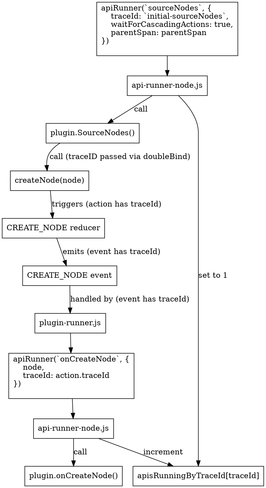

> Esta documentação não está atualizada com a versão mais recente de Gatsby.
>
> - mencionar como várias configurações são mescladas
> - o fluxo de criação de nodes no diagrama não está mais correto
> - `CREATE_NODE` e ʻonCreateNode` são tratados de forma diferente do descrito
>
> You can help by making a PR to [update this documentation](https://github.com/gatsbyjs/gatsby/issues/14228).

Para a maior parte dos sites, plugins tomam boa parte do tempo de construção. Então o que realmente  acontece quando APIs são chamadas?

_Nota: essa seção somente explica como `gatsby-node` plugins  funcionam. Não plugins de navegador ou de ssr_

## No Inicio da construção

No começo da fase  bootstrap , você [load all the configured plugins](https://github.com/gatsbyjs/gatsby/blob/8029c6647ab38792bb0a7c135ab4b98ae70a2627/packages/gatsby/src/bootstrap/load-plugins/index.js#L40) (e plugins internos) para  o site. Esses são salvos dentro do redux sob o `flattenedPlugins` namespace. Cada plugin no redux possui os seguintes campos:

- **resolve**: path absoluto para o diretório de plugins
- **id**: String concatenada do 'Plugin ' e o nome do  plugin. Ex. `Plugin query-runner`
- **name**: nome do plugin. Ex. `query-runner`
- **version**: a versão de acordo com o package.json. Ou se é um plugin do site, uma é  gerada a partir da hash do arquivo.
- **pluginOptions**: opções do plugin como especificado em [gatsby-config.js](/docs/gatsby-config/)
- **nodeAPIs**: Lista de node APIs que esse plugin implementa. Ex. `[ 'sourceNodes', ...]`
- **browserAPIs**: Lista de APIs de navegadores que esse plugin implementa
- **ssrAPIs**: Lista de  APIs SSR que esse plugin implementa.

Adicionalmente, você também cria um  lookup da api para os plugins que  a implementam e  salva isso para o  redux como `api-to-plugins`. Essa é a implementação em [load-plugins/validate.js](https://github.com/gatsbyjs/gatsby/blob/8029c6647ab38792bb0a7c135ab4b98ae70a2627/packages/gatsby/src/bootstrap/load-plugins/validate.js#L106)

## apiRunInstance

Algumas  requisições de API podem demorar. Então, cada vez que uma API é rodada, você cria um objeto chamado [apiRunInstance](https://github.com/gatsbyjs/gatsby/blob/8029c6647ab38792bb0a7c135ab4b98ae70a2627/packages/gatsby/src/utils/api-runner-node.js#L179) para rastrea-la. Ele contem os seguintes campos notáveis:

- **id**: identificador único gerado baseado no tipo da API
- **api**: A API que vocÊ está rodando. Ex. `onCreateNode`
- **args**: Quaisquer argumentos passados para `api-runner-node`. Ex. um  objeto node
- **pluginSource**: optional name of the plugin that initiated the original call
- **resolve**: promise resolve callback para ser chamado quando a  API acabou de rodar
- **startTime**: horário em que a API começou a rodar 
- **span**: opentracing span para rastrear construções
- **traceId**: args.traceId opcional se providos a  API resultarão em chamadas API mais longas ([see below](#using-traceid-to-await-downstream-api-calls))

Mova este objeto para dentro de um `apisRunningById` Map imediatamente, onde você rastreia sua execução.

## Rodando cada plugin

Depois, filtra-se todos os `flattenedPlugins` abaixo daqueles que implementam a  API você está tentando rodar. Para cada plugin, você requisita seu `gatsby-node.js` e chama  sua função API exportada. Ex. se a API era `sourceNodes`, deve resultar em uma chamada para `gatsbyNode['sourceNodes'](...apiCallargs)`.

## Argumentos Injetados

Implementações de API  possuem uma variedade de úteis [actions](/docs/actions/) e outras funções/objetos interessantes. Esses argumentos são [created](https://github.com/gatsbyjs/gatsby/blob/8029c6647ab38792bb0a7c135ab4b98ae70a2627/packages/gatsby/src/utils/api-runner-node.js#L94) cada vez que um plugin é rodado para uma  API, o que  nos permite realizar rebind  de actions com  informações padronizadas.

Todas as actions pedem 3 argumentos:

1.  A informação principal requisitada pela action. Ex. para [createNode](/docs/actions/#createNode), você deve passar um node
2.  O plugin que esta chamando a action. Ex. `createNode` usa isso para designar o dono do novo node
3.  Um objeto com opções de misc action:
    - **traceId**: [See below](#using-traceid-to-await-downstream-api-calls)
    - **parentSpan**: opentracing span (see [tracing docs](/docs/performance-tracing/))

Passar o plugin e as opções de  action em cada chamada de action pode ser extremamente caro para os autores do plugin/site. Desde que você conheça o plugin, traceId e parentSpan quando você está rodando sua API, você pode fazer o  rebind de injected actions para que esses argumentos já sejam fornecidos. Isso é feito neste [doubleBind](https://github.com/gatsbyjs/gatsby/blob/8029c6647ab38792bb0a7c135ab4b98ae70a2627/packages/gatsby/src/utils/api-runner-node.js#L14) passo.

## Esperando todos os plugins rodarem

Cada plugin roda dentro de uma [map-series](https://www.npmjs.com/package/map-series) promise, o que permite a eles serem executados concorrentemente. Uma vez que os plugins acabaram de rodar, você os remove de [apisRunningById](https://github.com/gatsbyjs/gatsby/blob/8029c6647ab38792bb0a7c135ab4b98ae70a2627/packages/gatsby/src/utils/api-runner-node.js#L246) e dispara um evento `API_RUNNING_QUEUE_EMPTY`. Isso, por sua vez, resulta na recriação de quaisquer páginas sujas, bem como em suas queries. Finalmente, os resultados são retornados.

## Usando traceID para aguardar chamadas de API downstream

A maioria das chamadas de API resulta na chamada de um ou mais plugins de implementação. Você então espera que todos eles sejam concluídos e voltem. Mas alguns plugins (por exemplo, [sourceNodes] (/docs/node-apis/#sourceNodes)) resultam em chamadas para ações que chamam APIs. Você precisa de alguma forma de rastrear se uma chamada de API foi originada de outra chamada de API, para que possa aguardar a conclusão de todas as chamadas filhas. O mecanismo para isso é o `traceId`.



1.O traceID é passado como um argumento para o executor da API original. Por exemplo

    ```javascript
    apiRunner(`sourceNodes`, {
      traceId: `initial-sourceNodes`,
      waitForCascadingActions: true,
      parentSpan: parentSpan,
    })
    ```

1.  Você controla o número de chamadas de API com este traceId no  [apisRunningByTraceId](https://github.com/gatsbyjs/gatsby/blob/8029c6647ab38792bb0a7c135ab4b98ae70a2627/packages/gatsby/src/utils/api-runner-node.js#L139) Map.Nesta primeira chamada, ele será definido como `1`.
1.  Usando a action de rebinding mencionada [above](#injected-arguments),  o traceId é passado para todas as chamadas de ação por meio do objeto ʻactionOptions`.
1. Depois de reduzir a Action, um evento global é [emitted](https://github.com/gatsbyjs/gatsby/blob/8029c6647ab38792bb0a7c135ab4b98ae70a2627/packages/gatsby/src/redux/index.js#L93) que inclui as informações da ação.
1. Para os eventos `CREATE_NODE` e` CREATE_PAGE`, você precisa chamar as APIs ʻonCreateNode` e ʻonCreatePage` respectivamente. O  [plugin-runner](https://github.com/gatsbyjs/gatsby/blob/8029c6647ab38792bb0a7c135ab4b98ae70a2627/packages/gatsby/src/redux/plugin-runner.js) cuida disso. Ele também passa o traceId da ação de volta para a chamada da API.
1.  Você está de volta ao ʻapi-runner-node.js` e pode amarrar esta nova chamada de API de volta ao seu original. Portanto, você incrementa o valor de [apisRunningByTraceId](https://github.com/gatsbyjs/gatsby/blob/8029c6647ab38792bb0a7c135ab4b98ae70a2627/packages/gatsby/src/utils/api-runner-node.js#L218) para esse traceId.
1.  Agora, sempre que uma API termina de ser executada (quando todos os seus plugins de implementação terminam), você decrementa ʻapisRunningByTraceId [traceId] `. Se a chamada API original incluiu a opção `waitForCascadingActions`, então você deve esperar até ʻapisRunningByTraceId [traceId]` == 0 antes de resolver.
