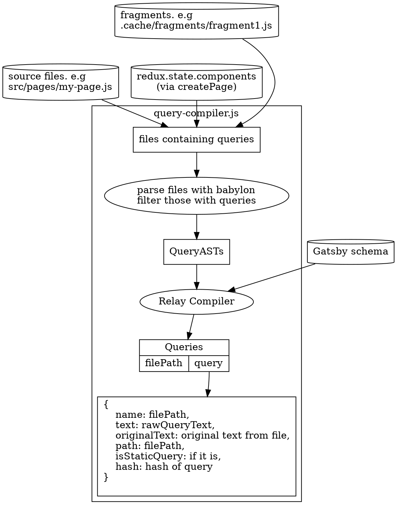
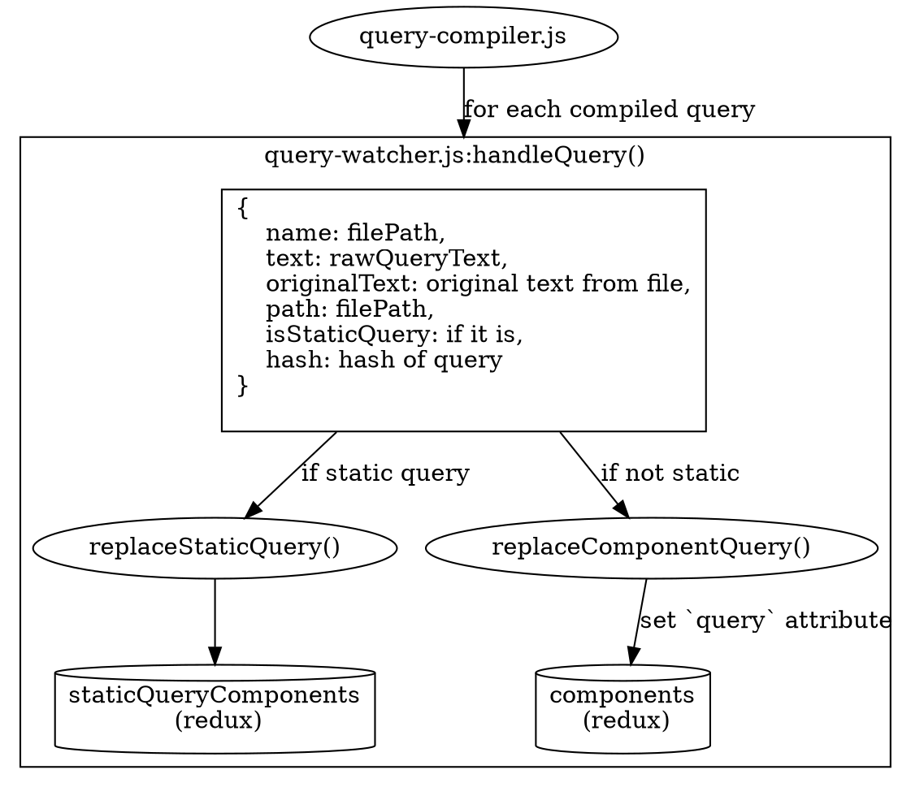
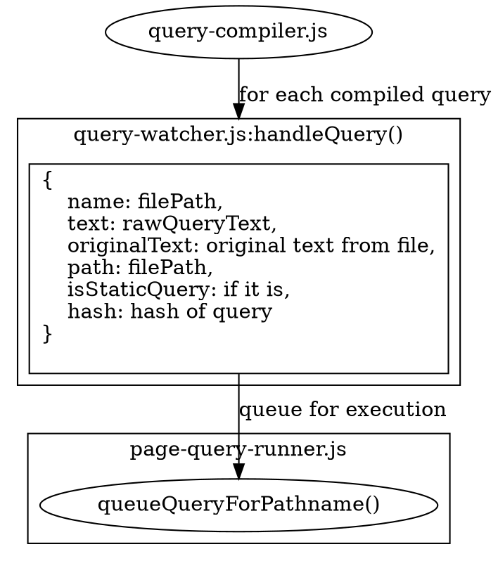

> Esta documentação não está atualizada conforme a última versão do Gatsby.
>
> Áreas desatualizadas:
>
> - consultas em dependências (node_modules) e temas agora também são extraidos
> - adicionar meta chave para _hook_ no diagrama JSON
>
> Você pode ajudar fazendo um PR para [atualizar esta documentação](https://github.com/gatsbyjs/gatsby/issues/14228).

### Extraindo Queries de Arquivos

Até o momento, nós [geramos os nós](/docs/node-creation/) no redux, [inferimos um esquema](/docs/schema-generation/) a partir deles e [criamos todas as páginas](/docs/page-creation/). O próximo passo é extrair e compilar todas as consultas graphql de nossos arquivos fonte. O ponto de entrada para esta fase é o [query-watcher extractQueries()](https://github.com/gatsbyjs/gatsby/blob/master/packages/gatsby/src/internal-plugins/query-runner/query-watcher.js), que compila todas as consultas graphql chamando o [query-compiler.js](https://github.com/gatsbyjs/gatsby/blob/master/packages/gatsby/src/internal-plugins/query-runner/query-compiler.js)

#### Compilação de consulta

A primeira coisa que ela faz é usar o [babylon-traverse](https://babeljs.io/docs/en/next/babel-traverse.html) para carregar todos os arquivos JavaScript do site que possuem consultas graphql. Produzindo AST que são passados para o [relay-compiler](https://facebook.github.io/relay/docs/en/compiler-architecture.html). Isso produz os seguintes resultados:

1. Informa sobre quaisquer consultas malformadas, que são prontamente relatadas ao usuário.
1. Cria uma árvore de consulta e fragmentos dos quais eles dependem. E gera uma única string de consulta otimizada com os fragmentos.

Após esta etapa, teremos um mapa dos caminhos de arquivos (arquivos do site com consultas) para os Objetos de Consulta, que contêm o texto otimizado bruto da consulta, além de outros metadados, como o caminho do componente e o `jsonName` da página. O diagrama a seguir mostra o fluxo envolvido durante a compilação de consultas

#### Armazenando Consultas no Redux

Agora estamos na função [handleQuery](https://github.com/gatsbyjs/gatsby/blob/master/packages/gatsby/src/internal-plugins/query-runner/query-watcher.js#L68).

Se a consulta for uma `StaticQuery`, chamamos a _action_ `replaceStaticQuery` para salvá-la no _namespace_ `staticQueryComponents`, que é um mapeamento do caminho do componente para um objeto que contém a Consulta GraphQL bruta, entre outras coisas. Mais detalhes em [Consultas Estáticas](/docs/static-vs-normal-queries/). Também removemos o `jsonName` do componente do _namespace_ `components` do redux. Consulte [Página -> Dependências dos nós](/docs/page-node-dependencies/).

Se a consulta é apenas uma consulta normal (não uma StaticQuery), atualizamos a `query` do componente no _namespace_ `components` do redux através da _action_ [replaceComponentQuery](https://github.com/gatsbyjs/gatsby/blob/master/packages/gatsby/src/redux/actions.js#L827).

#### Fila para execução

Agora que salvamos nossa consulta, estamos prontos para colocá-la em fila de execução. A execução da consulta é tratada principalmente pelo [page-query-runner.js](https://github.com/gatsbyjs/gatsby/blob/master/packages/gatsby/src/internal-plugins/query-runner/page-query-runner.js), portanto, precisamos passar o caminho do componente para a função `queueQueryForPathname`.

Agora vamos aprender sobre [Execução de Consulta](/docs/query-execution/).
