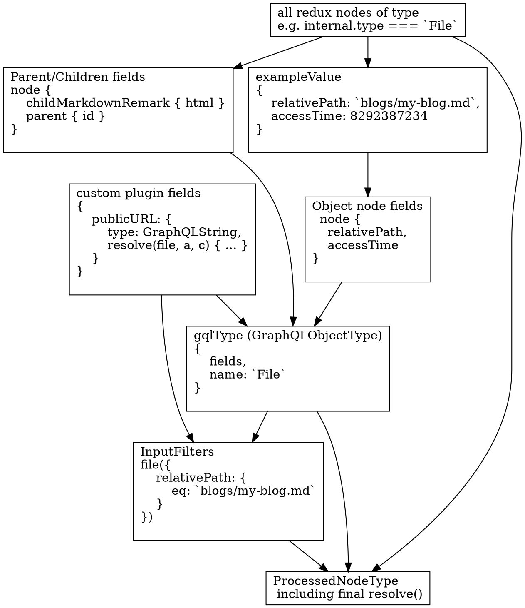

> Essa documentação não está atualizada com as últimas [mudanças de personalização do esquema](/docs/schema-customization).
> Você pode ajudar fazendo um PR para [atualizar esse documento](https://github.com/gatsbyjs/gatsby/issues/14228).

Depois que os nós forem originados e transformados, a próxima etapa é gerar o esquema do GraphQL. Essa é uma das partes mais complexas da base de código do Gatsby. De fato, até o momento, ele representa um terço das linhas de código no núcleo de Gatsby. Envolve a dedução de um esquema GraphQL de todos os nós que foram originados e transformados até o momento. Continue lendo para descobrir como é feito.

### Agrupe todos os nós por tipo

Cada nó originado ou transformado possui um `node.internal.type`, que é definido pelo plugin que o criou. Por exemplo, o plugin `source-filesystem` [define o tipo do arquivo](https://github.com/gatsbyjs/gatsby/blob/master/packages/gatsby-source-filesystem/src/create-file-node.js#L46). O plugin `transformer-json` cria um tipo dinâmico [baseado no nó pai](https://github.com/gatsbyjs/gatsby/blob/master/packages/gatsby-transformer-json/src/gatsby-node.js#L48). Por exemplo. `PostsJson` para um arquivo`posts.json`.

Durante a fase de geração do esquema, devemos gerar o que é chamado de `ProcessedNodeType` no Gatsby. Essa é uma estrutura simples que se baseia em um [graphql-js GraphQLObjectType](https://graphql.org/graphql-js/type/#graphqlobjecttype). Nosso objetivo nas etapas abaixo é inferir e construir esse objeto para cada tipo de nó exclusivo no redux.

O fluxo é resumido pelo gráfico abaixo. Ele mostra as transformações intermediárias ou partes relevantes da consulta GraphQL do usuário que são executadas por código no Gatsby [pasta do esquema](https://github.com/gatsbyjs/gatsby/tree/master/packages/gatsby/src/schema) , resultando finalmente no [ProcessedNodeType](https://github.com/gatsbyjs/gatsby/blob/master/packages/gatsby/src/schema/build-node-types.js#L182). Ele usa o exemplo de construção de um tipo GraphQL `File`.

### Para cada tipo único

A maioria do código de geração de esquema é iniciada em [build-node-types.js](https://github.com/gatsbyjs/gatsby/blob/master/packages/gatsby/src/schema/build-node-types.js) Os passos abaixo serão executados para cada tipo único.

#### 1. Plugins criam campos personalizados

Gatsby deduz tipos GraphQL dos campos nos nós originados e transformados. Mas antes disso, permitimos que os plugins criem seus próprios campos personalizados. Por exemplo, `source-filesystem` cria um campo [publicURL](https://github.com/gatsbyjs/gatsby/blob/master/packages/gatsby-source-filesystem/src/extend-file-node.js#L11) que, quando resolvido, copiará o arquivo no diretório `public/static` e retornará o novo caminho.

Para declarar campos personalizados, os plugins implementam a API [setFieldsOnGraphQLNodeType](/docs/node-apis/#setFieldsOnGraphQLNodeType) e aplica a alteração apenas aos tipos de que eles se importam (por exemplo, sistema de arquivos de origem [somente prossegue se type.name = `Arquivo`](https://github.com/gatsbyjs/gatsby/blob/master/packages/gatsby-source-filesystem/src/extend-file-node.js#L6). Durante a geração do esquema, o Gatsby chamará essa API, permitindo que o plugin declare esses campos personalizados, [que são retornados](https://github.com/gatsbyjs/gatsby/blob/master/packages/gatsby/src/schema/build-node-types.js#L151) para o processo de esquema principal.

#### 2. Crie um "GQLType"

Essa etapa é bastante complexa, mas, na sua forma mais básica, infere os campos do GraphQL construindo um `exampleObject` que mescla todos os campos do tipo no Redux. Ele usa isso para inferir todos os campos possíveis e seus tipos, e construir versões GraphQL deles. Faz o mesmo para os campos criados por plugins (como na etapa 1). Esta etapa é explicada em detalhes em [Criação de tipos de nós do GraphQL](/docs/schema-gql-type).

#### 3. Criar filtros de entrada

Esta etapa cria filtros de entrada do GraphQL para cada campo para que os objetos possam ser consultados por eles. Mais detalhes em [Criando os filtros de entrada](/docs/schema-input-gql).

#### 4. Criação de ProcessedTypeNode com implementação de resolução

Finalmente, temos tudo o que precisamos para construir nosso objeto final do tipo Gatsby (conhecido como `ProcessedTypeNode`). Ele contém os filtros de entrada e o gqlType criados acima e implementa uma função de resolução para ela usando sift. Mais detalhes na seção [Consultando com Sift](/docs/schema-sift).

#### 5. Criar conexões para cada tipo

Deduzimos todos os tipos de GraphQL e a capacidade de consultar um único nó. Mas agora precisamos ser capazes de consultar coleções desse tipo (por exemplo, `allMarkdownRemark`). [Conexões de esquema](/docs/schema-connections/) cuida disso.
