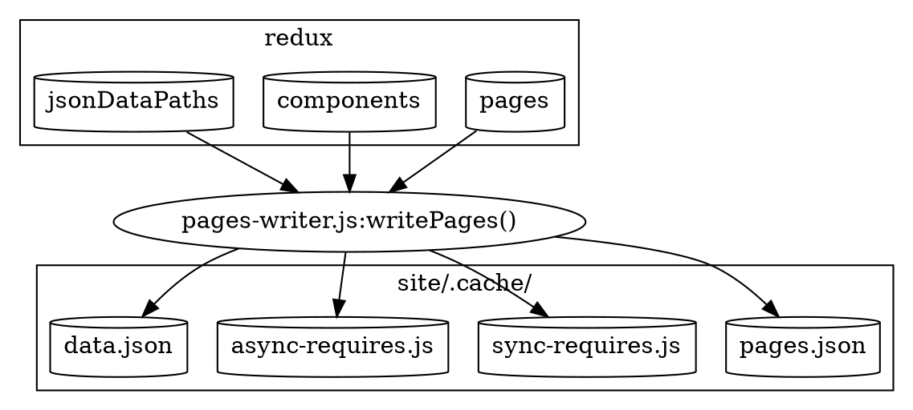

> Esta documentação não está atualizada com a versão mais recente do Gatsby.
>
> As áreas que estão desatualizadas são:
>
> - `data.json` deve ser substituído por `page-data.json`
> - remover menções de `pages.json`
> - descrever `match-paths.json`
>
> Você pode ajudar fazendo um PR para [update this documentation](https://github.com/gatsbyjs/gatsby/issues/14228).

Este é um dos últimos estágios de bootstrap antes de enviarmos para o webpack para executar a otimização e divisão do código. O Webpack cria um pacote para a web. Ele não tem conhecimento do código principal da Gatsby. Em vez disso, ele opera em arquivos no diretório `.cache`. Ele também não tem acesso a todas as informações do Redux que foram criadas durante a inicialização. Em vez disso, criamos arquivos Javascript e JSON dinâmicos que são dependentes da aplicação do webpack no diretório `.cache` (veja [Building the JavaScript App](/docs/production-app/)).

Você pode pensar nesta etapa como pegar todos os dados gerados durante a inicialização e salvá-los em disco para ser consumido pelo webpack.



A maior parte do código que acompanha esta seção está em [pages-writer.js](https://github.com/gatsbyjs/gatsby/blob/master/packages/gatsby/src/internal-plugins/query-runner/pages-writer.js)

Os arquivos dinâmicos criados são (todos no diretório `.cache`).

- [pages.json](#pagesjson)
- [sync-requires.js](#sync-requiresjs)
- [async-requires.js](#async-requiresjs)
- [data.json](#datajson)

## pages.json

Esta é uma coleção de objetos de página, criados a partir do namespace redux `pages`. Para cada página, inclui o

- [componentePedacoNome](/docs/behind-the-scenes-terminology/#componentchunkname)
- [jsonNome](/docs/behind-the-scenes-terminology/#jsonname)
- [caminho](/docs/behind-the-scenes-terminology/#path)
- [combineCaminho](/docs/behind-the-scenes-terminology/#matchpath)

As páginas são classificadas de forma que aquelas com `matchPath`s venham antes daquelas sem.
Isso é para ajudar [find-page.js](https://github.com/gatsbyjs/gatsby/blob/master/packages/gatsby/cache-dir/find-page.js) na seleção de páginas via regex antes de tentar caminhos explícitos. Veja [matchPaths](/docs/behind-the-scenes-terminology/#matchpath) para mais informações.

ex:

```javascript
[
  {
    componentChunkName: "component---src-blog-2-js",
    jsonName: "blog-c06",
    path: "/blog",
  },
  // mais páginas
];
```

`pages.json` é gerado apenas para fins `gatsby develop`. No `npm run build`, usamos [data.json](/docs/write-pages/#datajson) (abaixo) que inclui as informações das páginas e mais.

## sync-requires.js

Este é um arquivo JavaScript gerado dinamicamente que exporta `components`. É um objeto criado pela iteração no namespace redux `components`. As chaves são [componentChunkName](/docs/behind-the-scenes-terminology/#componentchunkname) (e.g. `component---src-blog-2-js`), e os valores são expressões que requerem o componente. Ex: `/home/site/src/blog/2.js`. O arquivo será algo parecido com isto:

```javascript
exports.components = {
  "component---src--blog-2-js": require("/home/site/src/blog/2.js"),
  // mais componentes
};
```

É usado durante [static-entry.js](https://github.com/gatsbyjs/gatsby/blob/master/packages/gatsby/cache-dir/static-entry.js) para que ele possa mapear componentChunkName para as implementações de componentes. Enquanto que o [production-app.js](https://github.com/gatsbyjs/gatsby/blob/master/packages/gatsby/cache-dir/production-app.js) deve usar `async-requires.js` (abaixo), pois ele executa [code splitting](/docs/how-code-splitting-works/).

## async-requires.js

---

O `async-requires.js` é muito semelhante ao `sync-requires.js`, pois é um arquivo JavaScript gerado dinamicamente. A diferença é que ele foi escrito para ser usado na divisão de código via webpack. Portanto, ao invés de usar `require` com o caminho do componente, ele usa `import` e adiciona uma dica `webpackChunkName` para que possamos eventualmente vincular o componentChunkName ao arquivo resultante (mais informações em [Code Splitting](/docs/how-code-splitting-works/) docs). `components` é uma função, para que possa ser inicializada lentamente.

`async-requires.js` também exporta uma função `data` que importa `data.json` ([see below](/docs/write-pages/#datajson))

Um exemplo de requisição assíncrona é:

```javascript
exports.components = {
  "component---src-blog-2-js": () =>
    import(
      "/home/site/src/blog/2.js" /* webpackChunkName: "component---src-blog-2-js" */
    ),
  // mais componentes
};

exports.data = () => import("/home/site/.cache/data.json");
```

Lembre-se de que, `sync-requires.js` é usado durante [Page HTML Generation](/docs/html-generation/). E o `async-requires.js` é usado por [Building the JavaScript App](/docs/production-app/).

## data.json

Este é um arquivo json gerado. Ele contém todo o conteúdo do `pages.json` ([como acima](/docs/write-pages/#pagesjson)), e todo o redux `jsonDataPaths` que foi criado no final do [Execução de Consulta](/docs/query-execution/#save-query-results-to-redux-and-disk) estágio. Então, isso parece com:

```javascript
{
  pages: [
    {
        "componentChunkName": "component---src-blog-2-js",
        "jsonName": "blog-2-c06",
        "path": "/blog/2"
    },
    // more pages
 ],

 // jsonName -> dataPath
 dataPaths: {
   "blog-2-c06":"952/path---blog-2-c06-meTS6Okzenz0aDEeI6epU4DPJuE",
   // more pages
 }
```

`data.json` é usado em dois lugares. Primeiro, ele é importado lentamente por `async-requires.js` (acima), que por sua vez é usado por `production-app` para [carregar resultados do json](/docs/production-app/#load-page-resources) para uma página.

Também é usado pela [Geração de HTML da página](/docs/html-generation/) de duas maneiras:

1. `static-entry.js` produz um pacote da web `page-renderer.js` agrupado pelo webpack que gera o HTML para um caminho. Isto requer `data.json` e usa as `pages` para procurar página por página.
2. Para obter `jsonName` do objeto da página e usá-lo para construir um caminho de rescurso para o resultado real do json, procurando em `data.json.dataPaths[jsonName]`.

Agora que escrevemos os dados da página, podemos começar na [Seção Webpack](/docs/webpack-and-ssr/).
